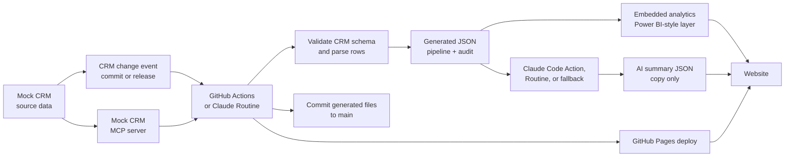

# Architecture

## Guardrails

- The mock CRM owns operational data.
- The MCP server exposes CRM data as tools/resources.
- The automation freezes CRM data into a validated public snapshot.
- Required fields are checked before any website data is written.
- Numeric fields, probabilities, stages, and ISO dates are validated.
- The website reads from `site/data/pipeline.json`; it does not hardcode metrics.
- AI copy reads from `site/data/pipeline.json` and writes to `site/data/ai-summary.json`.
- Narrative cards include source keys so reviewers can trace every claim.
- The audit log records source file, source system, revision, hash, and validation checks.

## Where An LLM Fits

Claude Code Action or a Claude Routine can replace the local simulated AI step. The contract stays the same: the agent receives validated JSON, writes bounded website copy, and includes evidence keys for every published claim.
